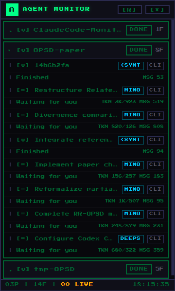
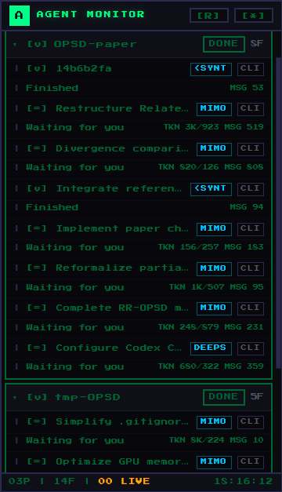
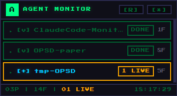

# Agent Monitor

> A native floating desktop widget for real-time AI coding agent session monitoring across all projects.


---

## What Is Agent Monitor?

Agent Monitor is a **pixel-mechanical styled always-on-top widget** that gives you a single pane of glass into every Claude Code session running across all your projects — VSCode and CLI alike.

**Claude Code** is powerful, but its sessions are scattered. You might have three VSCode windows open, each with its own Claude Code conversation, plus a terminal running another one. Agent Monitor puts all of them in one small, resizable window that floats on your desktop and updates in real time.

### At a Glance

- **Which projects** have active Claude Code sessions
- **What each session is doing right now** — executing tools, thinking, responding, or waiting for your input
- **Live tool details** — `Running Bash // cargo build`, `Editing // lib.rs`
- **Token usage**, session uptime, message count, cost estimate
- **Source** — VSCode or CLI, model name abbreviated (OPUS / SONNET / HAIKU / MIMO)

---

## Screenshots

### Collapsed view — all projects folded



### Expanded view — sessions visible with tool details



### Active sessions — real-time status with live indicators



---

## Status System

Agent Monitor uses a terminal-inspired visual language optimized for quick scanning:

### Session Status

| Symbol | Status | Color | Meaning |
|---|---|---|---|
| `[>]` | Working | Amber `#ffaa00` | Claude is executing a tool (Bash, Edit, etc.) |
| `[~]` | Thinking | Purple `#aa66ff` | Claude is reasoning internally |
| `[#]` | Responding | Cyan `#00ccff` | Claude is generating text output |
| `[=]` | Idle | Green `#00ff88` | Finished a response, waiting |
| `[v]` | Done | Dim green `#006633` | Waiting for your next prompt |

### Project Status

| Badge | Meaning |
|---|---|
| `N LIVE` / `[+]` | Project has active sessions (working/thinking/responding) |
| `DONE` / `[v]` | All sessions in this project are completed |

### Header Counters

| Counter | Meaning |
|---|---|
| Green `[NN]` | Total tracked session files across all projects |
| Yellow `[NN]` | Sessions NOT yet done — needs your attention |

### Smart Status Detection

- **Agent multi-step awareness** — Quick pauses between tool calls are NOT mistaken for "done". Session stays "working" while Claude is still processing
- **Silence timeout** — Stuck responding/thinking sessions auto-convert to "done" after 10 seconds of no file changes
- **Long-thinking detection** — Sessions in the thinking phase for 1-2 minutes are correctly detected via file-history directory mtime, even when the JSONL transcript hasn't been updated yet

---

## How It Works

### Session Discovery

```
~/.claude/
├── projects/                    # All Claude Code sessions live here
│   ├── d--dev-MyProject/        # Encoded project path (workspaceToProjectName)
│   │   ├── <uuid>.jsonl        # Session transcript files
│   │   └── ...
│   └── ...
├── file-history/                # Per-session activity tracking
│   ├── <session-id>/           # Directory mtime = last activity time
│   └── ...
└── ide/                         # VSCode integration
    ├── <PID>.lock              # Active VSCode window metadata
    └── ...
```

1. **Discovery** — Scans `~/.claude/projects/` for all session transcript (`.jsonl`) files
2. **Active detection** — Cross-references with `~/.claude/file-history/` directory modification times
3. **IDE matching** — Parses `~/.claude/ide/*.lock` files, checks PIDs are alive, encodes workspace folders to match project directories
4. **Incremental parsing** — Tracks file modification times and byte positions; only re-parses files that have changed since last scan
5. **Real-time updates** — `PollWatcher` (mtime polling every 2 seconds) + frontend fallback polling

### Status Parsing

Each JSONL line is parsed to extract:
- **Message role** — `user` (your prompts + tool results) vs `assistant` (Claude's responses)
- **Content blocks** — `tool_use` (tool calls), `thinking` (reasoning), `text` (visible output)
- **Stop reason** — `tool_use` (Claude handed off to a tool) vs `end_turn` (Claude finished its turn)
- **Metadata** — model name, token usage, cost, timestamp

### Session Caching

- **Mtime-aware** — Files are only re-parsed when their modification time changes
- **PID cache** — IDE lock file PID liveness is cached to avoid repeated `tasklist` calls
- **Incremental reads** — Tracks byte offsets, seeks to last position, reads only new data

---

## Installation

### Download (Recommended)

Go to [GitHub Releases](https://github.com/Hoemr/agent-monitor/releases) and download the binary for your platform:

| Platform | File | Size |
|---|---|---|
| **Windows** | `agent-monitor.exe` | ~4.5MB |
| **macOS** (Intel) | `agent-monitor-x86_64-apple-darwin` | ~5MB |
| **macOS** (Apple Silicon) | `agent-monitor-aarch64-apple-darwin` | ~5MB |
| **Linux** | `agent-monitor-x86_64-unknown-linux-gnu` | ~6MB |

Releases are built automatically by GitHub Actions on every version tag (`v*`). No installer, no dependencies — just download and run.

### Build from Source

```bash
git clone https://github.com/Hoemr/agent-monitor.git
cd agent-monitor
npm install
npx tauri build
```

Binary at `src-tauri/target/release/`. Prerequisites: [Rust](https://rustup.rs/) 1.70+, [Node.js](https://nodejs.org/) 18+. Linux additionally requires `libwebkit2gtk-4.1-dev`.

---

## Usage

| Action | How |
|---|---|
| Open / Close window | Left-click tray icon |
| Move window | Drag the header |
| Resize window | Drag any edge or corner |
| Expand / Collapse project | Click the project folder header |
| Open session in VSCode | Click any session row |
| Manual refresh | Click `[R]` button |
| Context menu | Right-click anywhere in the window |
| Adjust polling speed | Right-click → Poll: 3s / 5s / 10s |
| Hide to tray | Right-click → Hide Window |
| Quit | Right-click → Quit or tray menu → Quit |

---

## Design Philosophy

### Why a Native Desktop Widget?

Web dashboards live in a browser tab — easy to lose among dozens of other tabs. Terminal tools like `claude status` require you to type a command every time you want to check.

A floating always-on-top widget is **always visible but never in the way**. You can glance at it while coding, see that a long-thinking session has started responding, and jump back in at exactly the right moment.

### Why Tauri 2.0?

| | Tauri 2.0 | Electron |
|---|---|---|
| Binary size | ~4.5MB | ~120MB+ |
| Memory (idle) | ~15MB | ~80MB+ |
| Native feel | Yes (OS WebView) | Chromium embedded |
| Startup time | < 1 second | 3-5 seconds |
| Bundled runtime | No | Yes (embedded) |

### Pixel-Mechanical Aesthetic

The dark terminal color palette (`#0a0a0f` background, `#00ff88` green, `#ffaa00` amber) with Consolas monospace, sharp borders, and glowing status indicators is deliberate. It signals: **this is a tool for programmers, by programmers**.

---

## Compared to Alternatives

| Feature | Agent Monitor | claude-super-monitor | cc-switch |
|---|---|---|---|
| **Interface** | Native floating widget | Web dashboard | Desktop app |
| **Always-on-top** | Yes | No | No |
| **Multi-project view** | Yes | Yes | Per-session |
| **Real-time status** | 2s PollWatcher | fs.watch + WS | N/A |
| **Session detection** | file-history + IDE | file-history + IDE | N/A |
| **Tool details** | Yes | Yes | No |
| **Token/cost tracking** | Yes | Estimated | Yes |
| **Interactive hooks** | No | Yes (user questions) | N/A |
| **Memory usage** | ~15MB | ~80MB | ~30MB |
| **Install size** | ~4.5MB | ~50MB | ~15MB |

---

## Project Structure

```
agent-monitor/
├── src/                        # Frontend (HTML/CSS/JS)
│   ├── index.html
│   ├── style.css               # Pixel-mechanical theme
│   └── main.js                 # Rendering, context menu, polling
├── src-tauri/                  # Rust backend
│   ├── src/
│   │   ├── main.rs             # Entry point
│   │   └── lib.rs              # Scanner, parser, watcher, tray
│   ├── Cargo.toml
│   ├── tauri.conf.json         # Window/tray/security config
│   └── icons/                  # icon.ico + icon.png
├── gen-icon.js                 # Pixel-art icon generator
├── README.md                   # This file (English)
└── README_ZH.md                # Chinese version
```

---

## Platform Support

| Platform | Status |
|---|---|
| **Windows 10/11** | Fully supported and tested |
| **macOS** | Should work (built on Tauri 2.0 cross-platform) |
| **Linux** | Should work (requires WebKitGTK) |

---

## License

MIT
